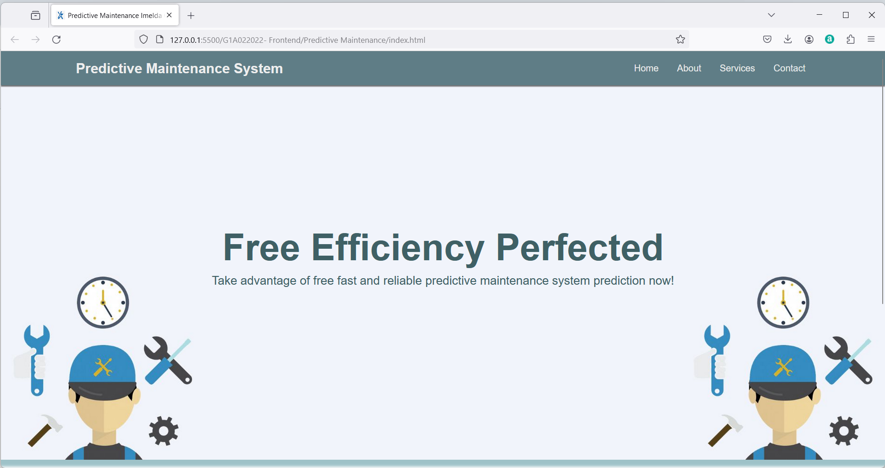
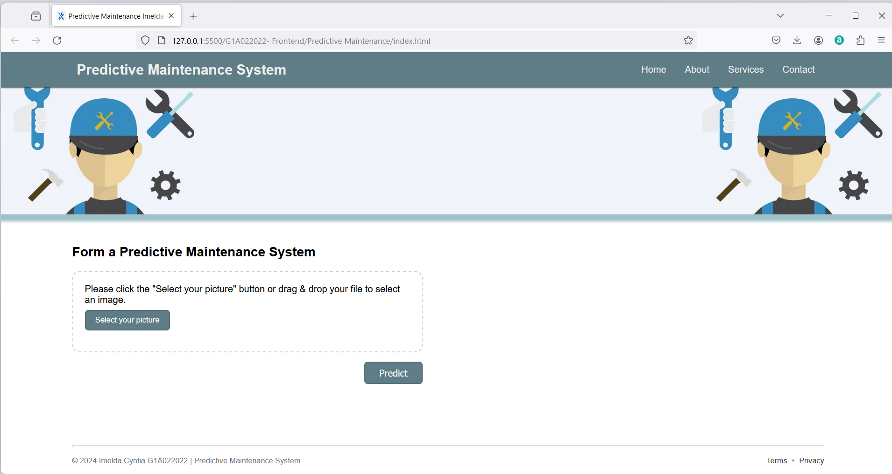

# G1A022022-Final-Project-AI
Predictive Maintenance System merupakan teknologi yang menawarkan pendekatan pemeliharaan peralatan yang lebih efisien dan proaktif dibandingkan metode tradisional. Sistem ini memanfaatkan sensor untuk memantau kondisi peralatan secara real-time. Data dari sensor-sensor tersebut kemudian dianalisis menggunakan algoritma machine learning dan kecerdasan buatan (AI) untuk memprediksi kemungkinan kegagalan peralatan sebelum terjadi.

Predictive Maintenance System bertujuan untuk meminimalkan downtime dan biaya dengan memprediksi kerusakan sebelum terjadi. Dengan memanfaatkan data historis dan real-time dari sensor yang terpasang pada peralatan, perawatan prediktif dapat menentukan kondisi kesehatan peralatan dan memprediksi waktu yang optimal untuk melakukan perawatan. Hal ini tidak hanya mengurangi biaya perbaikan dan downtime, tetapi juga memperpanjang umur peralatan dan meningkatkan efisiensi operasional.

## Home

Situs website yang telah saya buat untuk predictive maintenance system menampilkan judul "Free Efficiency Perfected" dengan tagline "Take advantage of free fast and reliable predictive maintenance system prediction now!". Situs web Predictive Maintenance System memiliki navigasi utama dengan pilihan seperti "Home", "About", "Services", dan "Contact". Sistem ini menggunakan sensor untuk pemantauan serta algoritma machine learning dan artificial intelligence untuk menganalisis data. Sehingga, predictive maintenance system dapat memprediksi potensi kegagalan sebelum terjadi.

## Form

Untuk bagian form saya membuat agar pengguna dapat mengunggah gambar yang akan diprediksi oleh predictive maintenance system. Pengguna dapat memilih dua cara untuk memasukkan gambar. Dengan mengklik tombol "Select Your Picture" untuk memilih gambar atau dengan drag & fdrop gambar ke area yang disediakan. Setelah gambar dimasukkan, klik tombol "Predict" untuk memulai proses prediksi kerusakan. Selanjutnya, sistem akan menganalisis serta memberikan hasil prediksi.
